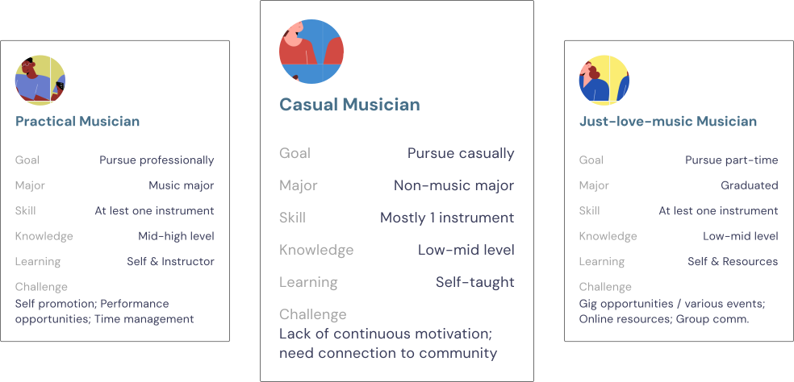
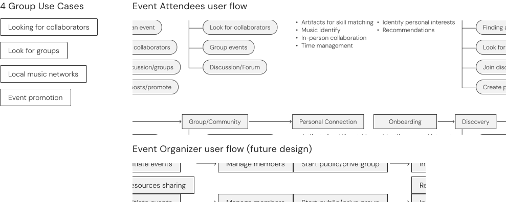

# DubJam

Status: In progress
tag: Design

# DubJam: How I Led a 0-to-1 Design to Foster Local Music Community

Subtitle: Designing a mobile platform to help UW student musicians find collaborators and connect
Eyebrow: DFA Design project · 2024.10 – 2025.5
Cover: ../../img/design/DubJam-page-cover.svg

## Project Meta

| Field | Details |
|---|---|
| Role | Lead Designer |
| Keywords | Concept Test, Design System, Community Growth |
| Timeline | 2024.10 - 2025.5 |
| Team | 3 UXD, 1 Visual Designer, 1 PM/UXR |

---

## Project Overview

### Student Musicians Want to Connect but Can't Find Compatible Musicians or Relevant Resources

This project was part of **Design for America** at the University of Washington, a national initiative that empowers student teams to use design for local social impact. Our team, all passionate about music, was personally motivated by one teammate's experience of struggling to find someone to practice with on campus. What began as an individual story quickly revealed a broader problem.

### Project Goal

Our goal was to design a mobile app that fosters collaboration and connection among musicians, starting with UW students and expanding to the broader Seattle music community. While there is no direct business goal, we were interested in validating this concept for exploring campus partnerships for launch and adoption, with potential for expansion to other universities or cities.

:::goal
HMW: Help solo musicians connect with compatible collaborators, access relevant local resources and events, and build a supportive music community
Users: UW student musicians and emerging local Seattle artists looking for collaborators or performance opportunities.
Needs: Finding compatible musicians, navigating a busy schedule, and a low-stakes space to connect and grow.
:::

### Impact and Outcomes

:::findings
FINAL PRESENTATION | Presented at the DFA UW Spring Showcase to a panel of Qualtrics UX professionals and UW design faculty, receiving strong positive feedback.
USER TESTING | Tested with 4 UW musicians; rated an average of 8.5/10 on "Would recommend to others," validating both usability and interest.
NEXT STEP | Exploring partnerships with HuskyJam and UW's Student Activities Office to pilot DubJam for campus music events and student-led jam sessions.
:::

[ghost-button:Take me straight to the solution →:#dp-design]

---

## Research

### What Existing Solutions Get Wrong — and What Musicians Actually Need

We ran a **competitive analysis** of existing music apps, reviewed literature on music collaboration, and conducted **9 in-depth interviews** with UW students — including organization leaders, solo musicians, and band members. Five insights shaped our direction:

:::findings
FRAGMENTED DISCOVERY | Students rely on non-dedicated platforms like Facebook and Reddit, making information discovery fragmented.
CAREER OVER COLLABORATION | Most apps are designed for music career-building and self-promotion rather than casual or exploratory collaboration.
SOLVING FOR THE MISMATCH | Musicians struggle to find compatible musicians with similar interests or matching skills. This is especially hard for newcomers.
BUSY MUSICIANS, BUSY LIFE | People often juggle between music and other life commitments, making it challenging to coordinate. In-person casual collaboration is key, but using digital tools to connect increases opportunities.
:::

[ghost-button:See more research artifacts]

## How Might We

After multiple rounds of debriefs with the team, we asked ourselves:

:::callout How Might We
Help solo musicians connect with compatible collaborators, access relevant local resources and events, and build a supportive music community
:::

---

## Design Decisions

### Decision 1: We designed for different types of musicians, but focused on making it easy for the casual ones

Our research showed that not all musicians are alike: some just want to jam for fun, while others are more goal-oriented or deeply passionate. Each type had different needs in terms of effort level, motivation, and how much information they could handle.

**Our solution:** We prioritized the experience of the "casual guy." These users often felt excluded by more serious or complex platforms. By keeping things low-pressure and approachable, we made it easier for casual musicians to join in, browse groups, and connect without friction.

### Decision 2: We focused on the event experience and user flows first

We noticed that most student musicians first show up as event attendees, not organizers. So instead of trying to design for everyone at once, we focused our efforts on creating a smooth and motivating experience for the everyday event-goer.

We also accounted for other user flows, such as group moderators, and began defining how features might scale to support both public groups (open live house) and private groups (bands).

### Decision 3: Validating our wildly different hypotheses with concept testing

After narrowing down our personas, we hit a wall. We had two drastically different concepts:

:::concept-pair
Concept 1 | A community-based app that centralizes event and group info for resources and knowledge learning | Dubjam-img3.svg | warm
Concept 2 | A gamified experience that encourages in-person connections and rewards collaborations | Dubjam-img4.svg | cool
:::

When we couldn't agree on a direction, users showed us what actually mattered. Testing revealed that:

- Emphasizing connection rather than increasing likes or follower counts
- Users are not looking for new best friends, but potential collaborators
- Users want easy access to encouraging information about local events
- A need for external motivation wasn't identified as a priority, and could push away users who are already motivated by the music itself

With a clearer direction, we prioritized three key experiences:

:::priority-blocks
Meaningful collaboration | Help musicians discover compatible collaborators, with events and groups acting as springboards for connection. | people
Centralized info hub | A centralized hub of information and communications dedicated to local musicians. | info
Personalized discovery | Personally recommended events, groups, and compatible collaborators to support the varied music population. | search
:::

### Design system: Collaboration with a visual designer

Musicians bring their own bold visual identity through event posters and promotional materials. The app needed a design system strong enough to feel intentional, but restrained enough not to compete. Working with a visual designer, I defined content structure and used an atomic design approach to keep components clear, flexible, and visually harmonious.

:::image-stack
../../img/design/dubjam/Dubjam-img5.svg
../../img/design/dubjam/Dubjam-img6.svg
:::

---

## Design

[ghost-button:← Curious how we got here?:#dp-research]

:::dj-features
== Explore | Discovery · Event · Search | left-wide | ../../img/design/dubjam/Dubjam-Discovery.mp4 | ../../img/design/dubjam/Dubjam-img8.svg
- Personalized content recommendations based on profile
- Search specific genres, events, groups, users, and posts
- Centralized information hub
== Find Community | Group | right | ../../img/design/dubjam/Dubjam-group.mp4
- Organized group connected around a shared interest
- Streamlined communication and information for group-relevant content
- Groups vary in scale and purpose
== Your Music Identity | Profile · Onboarding | full | ../../img/design/dubjam/Dubjam-onboarding.mp4 | ../../img/design/dubjam/Dubjam-calendar.mp4
- Onboarding for a customized user experience
- Tags to help personalize recommendations and learn about you at a glance
- Calendars to manage events across groups and interests
:::

---

## Outcomes

### Project Outcome and Impact

We showcased DubJam at the DFA UW Spring Showcase, earning positive feedback from Qualtrics UX professionals and UW design faculty.

Usability testing with four UW musicians backed this up, with an average 8.5/10 "Would recommend," confirming both its appeal and ease of use.

:::img-pair
../../img/design/dubjam/Dubjam-img10.svg
../../img/design/dubjam/Dubjam-img11.svg
:::

---

## My Learnings

### Navigating Team Disagreements

With six team members, each with their own vision for the project, disagreements were inevitable. As the design lead, I often had to make tough calls. Early on, we'd get stuck in long debates that went nowhere. I realized I needed to shift from simply mediating to actively guiding decisions. I started digging into the "why" behind each opinion and backing up choices with research and clear reasoning. This not only helped us move forward faster but also built trust in the process — even when not everyone's idea made it into the final design.
