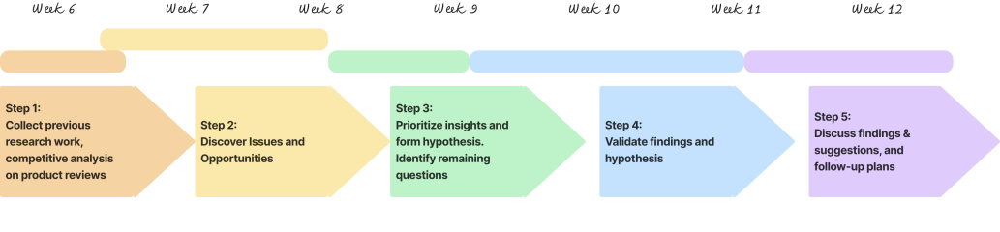
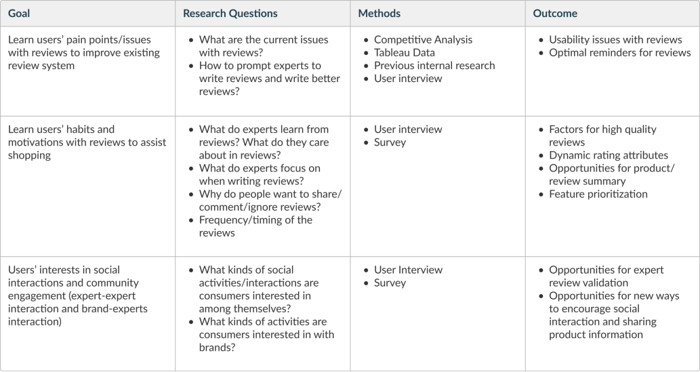

# ExpertVoice

Status: In progress
tag: Research

# ExpertVoice Product Review

Subtitle: Enhancing Product Reviews to Strengthen Community Engagement

Eyebrow: Intern Research Project · 2024 Summer

Cover: ../../img/research/EV-page-cover.svg

## Project Meta

| Field | Details |
| --- | --- |
| Role | UX Research Intern |
| Keywords | User Interview, Survey, Stakeholder Management |
| Timeline | 6 weeks |
| Team | 2 UXD, 1 Engineer, 1 UXR, 2 PM, 1 BA |

---

## Project Overview

### The Challenge

ExpertVoice is an e-commerce platform for the pro-deal industry, where experts purchase products with company-provided discounts. Reviews are central to the experience: users spend about 20 minutes reading 11+ reviews per purchase. But metrics were declining fast: a consistent 10–30% YOY drop in quality, and a 36.26% drop in quantity in June 2024 alone.

### Project Goal

Improve the review system to enhance product understanding, boost user engagement, and create a better shopping experience.

**Research question:** How can we improve the review system to enhance product understanding, boost engagement, and create a better shopping experience?

### Impact & Outcomes

- Targeted a **30% increase in review quantity** and **20% improvement in quality**
- Affected **302k+ users**
- Features like AI-generated product summaries entered internal testing within weeks of completion

---

## Methodology

### Research Goals and Questions

### Detailed Methods

**Desk Research:** Reviewed internal research and Tableau reports with a business analyst, explored Baymard Research, and ran a competitive analysis on how platforms design and use product reviews.

**User Interviews:** Interviewed 10 participants for 30 minutes each. Created the interview protocol, partnered with a UX writer to recruit via Pendo, then analyzed results.

**Survey:** Built a three-part survey in Lyssna, deployed via Pendo, targeting 150 responses for 95% confidence with an 8% margin of error.

---

## Challenges

### Challenge 1: Turning a Research Gap into a Cross-Functional Collaboration

When I reviewed internal data, I discovered something surprising: despite months of declining review metrics, no one had studied the review feature. I initiated this project and brought together PMs, designers, and engineers who had previously worked on reviews — approaching each stakeholder individually first before running joint workshops to prioritize interests, formalize hypotheses, and brainstorm solutions together.

### Challenge 2: Setting the Standard as the First Product Researcher

There was no consistent research process when I joined. I built on existing templates but went further — documenting all materials thoroughly, planning every step in advance, and clearly defining roles and expectations with stakeholders upfront. This created a reusable framework the team could carry forward.

---

## Key Takeaways

### Topline Finding

Experts on ExpertVoice value insightful reviews, especially for time-sensitive decisions — reviews play a crucial role in their purchasing process.

### Revised Jobs To Be Done

> "When I show I'm an expert, I want my voice to be heard, so I feel **validated in sharing my knowledge, helping others make informed decisions, and contributing to a trusted community.**"
> 

[linkedin-button]

---

## Next Steps

The project was well-received: I presented findings to company executives and at a weekly town hall. Stakeholders appreciated both the insights and the collaborative process, with many expressing greater interest in incorporating research into their work going forward.

Completed in September 2024, this research targeted a 30% increase in review quantity and 20% improvement in quality for 302k+ users. Early implementation of AI-generated summaries marked the first step toward these goals, with additional features in development.

---

## My Learnings

### Building Stakeholder Engagement

I had to build my own stakeholder group from scratch, and my first kickoff meeting was rough — people didn't engage or follow through. I learned to set clearer expectations upfront and take full ownership of driving the project forward, since it wasn't part of anyone else's planned workload.

### Overcoming Imposter Syndrome

Being the only product researcher at a company with no research culture was intimidating. My strategy became focusing on small wins by sharing one meaningful insight at a time and building relationships one stakeholder at a time. The turning point came when people started approaching me with their own questions.