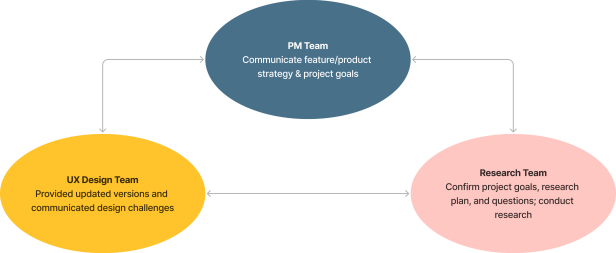
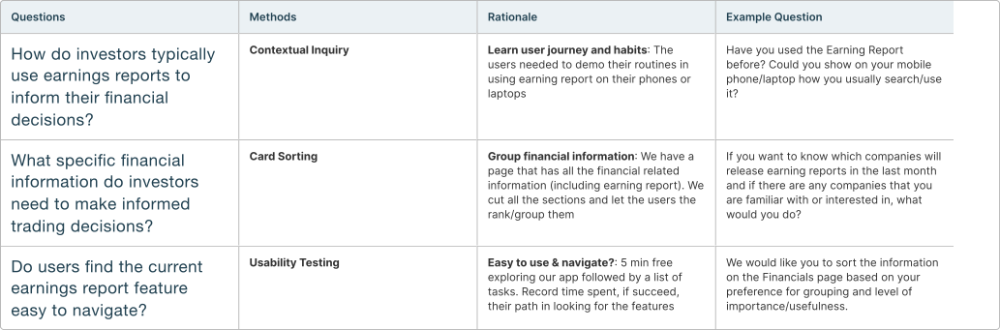
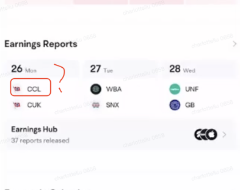
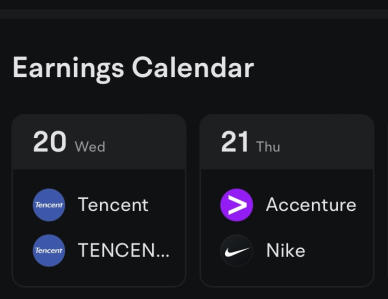

# Moomoo

Status: In progress
tag: Research

# Testing Moomoo Earning Report

Subtitle: Enhancing Earnings Reports for Smarter Investor Decisions

Eyebrow: Intern Research Project · 2023 Summer

Cover: ../../img/research/Moomoo-page-cover.svg

## Project Meta

| Field | Details |
| --- | --- |
| Role | UX Research Intern |
| Keywords | User Interview, Survey, Stakeholder Management |
| Timeline | ~2 months |
| Team | 3 UXD, 2 UXR, 2 PM |

---

## Project Overview

### Why Study Earnings Reports?

Earnings reports are crucial for stock investors — they help identify trading opportunities and support informed decisions. While the product team believed providing earnings reports was essential, there was ==no understanding of how users actually interacted with the feature or whether it met their needs==.

### Project Goal

Understand how investors use earnings reports to enhance the feature's trading utility, user-friendliness, and navigation — ultimately driving higher engagement and more informed decisions.

**Research question:** How do investors use the Earnings Report to find trading opportunities, and how do we make it easy to find and genuinely useful?

### Impact & Outcomes

- **10+ recommendations** for product strategy, mobile/web features, and ad design
- **7+ UX issues** identified
- Research impacted **over 21 million users** worldwide

---

## Methodology

### A Combination of Exploratory and Evaluative Methods

Three core questions guided the work: How do investors use earnings reports for financial decisions? What specific information do they need? Do users find the current feature easy to navigate?

Getting to these questions required working closely with designers and the PM to reframe what they actually needed to know. For example, instead of asking "Where do you think the feature should be?", we observed users' natural behavior as they tried to find it — ==a small but important methodological distinction==.

### Methods

### Recruiting

We recruited 9 participants — 6 advanced traders and 3 novices — screening for trading experience, strategies, and portfolios based on company personas. This ==naturally skewed toward advanced traders, aligning with the company's strategic focus== on bridging the gap between advanced novices and experienced traders.

---

## Key Takeaways

### Finding 1: Investors only want reports for companies they're already tracking
Half of participants don't want a calendar with all earnings reports; ==they only care about companies on their watchlists==. They're interested in a company first, then seek out its earnings report. Since investors don't recognize stock symbols for companies outside their interests, they may lose interest in the feature entirely.

### Finding 2: Text-based reports from trusted sources, with reminders, work best
Most participants prefer reading reports after release rather than watching live, cross-referencing Google Finance, Google News, the SEC, and Yahoo Finance. Key metrics (PE ratio, revenue, estimates) matter most. Timely reminders to review reports were also valued.

### Finding 3: Users can't find the feature due to an information architecture problem
The earnings report is currently under the Market page, but most participants expected to find it under a specific company/stock or in the News section. People associate earnings reports with individual companies or news updates. They typically care about a company first, then look for its earnings report, finding it easier on the company page even with more steps. Many also check News and use search to find features.

- Quick fix: Surface reports on company pages and improve Search
- Long-term: Tree test to restructure the Market page hierarchy

### Finding 4: Investors mentally group financial information into 4 categories

1. Financial data (revenue, earnings, estimates)
2. Institutional (shareholders, institutions, funds)
3. Dividends
4. Company overview

---

## Next Steps

### Recommended Design Changes

After conducting the research, we provided the designers and PMs with detailed pain points and feature feedback list, including videos, images, and the level of importance for each issue. This information was used for the next iteration of the design. We also wanted to ==monitor how much of the feedback the development teams acted on==, as well as to track progress following discussions with the designers and product managers.

:::two-col

:::

### Research Practice Workshop and Sharing Knowledge to Greater Audience

Based on the experience the research team gained in this project, we participated in a workshop that helped designers to a better awareness & understanding of the U.S. market mental models and user habits. Beside the group workshop, I found that many designers were not aware of how to use research to solve design problems, so I shared a simple UX research guide in the report meeting as a way to better facilitate cross-team communication.

---

## My Learnings

### Building Trust in a New Team

Working with a large group of designers and PMs taught me that trust isn't automatic. The breakthrough came when I stopped trying to prove myself and started showing genuine curiosity about their work — once they saw I valued their expertise, they began sharing the real challenges that shaped our project direction.

### Making Stakeholders True Partners

Instead of presenting research plans to stakeholders, I brought them in from day one — brainstorming questions together, debating what we needed to know, and exploring insights as they emerged. When we presented findings, ==they were advocates rather than skeptics because they had been part of the journey==.