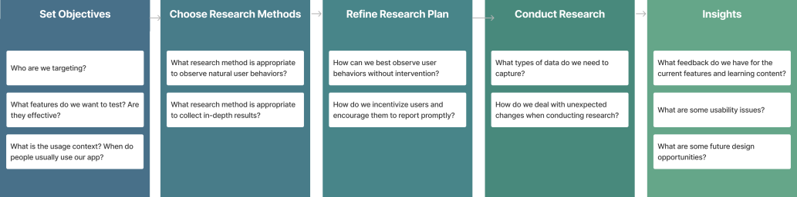
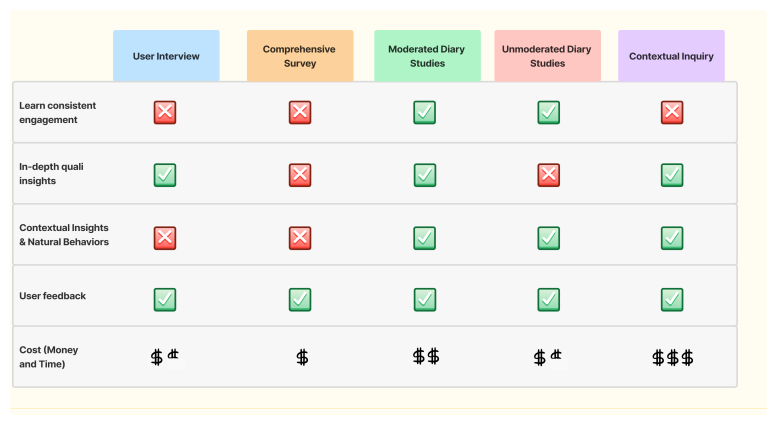
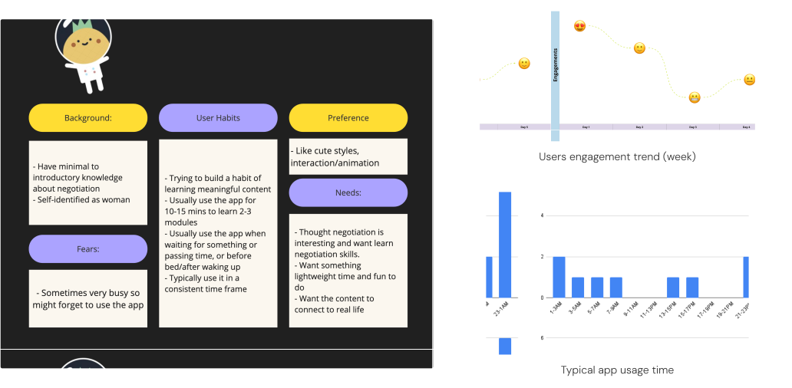

# Negotium

Status: In progress
tag: Research

# Negotium App

Subtitle: Evaluating User Engagement and Content Quality

Eyebrow: UX Researcher · 2024 Spring

Cover: ../../img/research/Negotium-page-cover.svg

## Project Meta

| Field | Details |
| --- | --- |
| Role | UX Researcher |
| Keywords | Diary Study, Evaluative Research, Agile Team |
| Timeline | 3 months |
| Team | 2 UXD, 2 Engineers, 1 UXR, 1 PM |

---

## Project Overview

### What is Negotium?

Negotium is an app designed to empower women with the knowledge and strategies needed for effective negotiation in the workplace, classroom, or everyday life. Research shows that ==women negotiate less often than men, contributing to leadership and wage gaps==. Negotium provides scalable access to training tools to help women advocate for themselves more effectively.

### Project Goal

The app MVP v2 launched in TestFlight with new content and features, but the team needed to understand whether users would actually integrate it into their daily routines.

**Research question:** How do users engage with the app's features and learning content in their daily lives, and how can we improve the app to enhance that engagement?

### Impact & Outcomes

- **9 usability pain points** identified
- **5 common user themes** surfaced
- **4 design flows** recommended
- **1 strategic pivot** prompted

---

## Methodology

### Choosing the Right Method

Since no one else on the team had experience with user studies, I designed the entire project myself. Our goal was understanding consistent app usage, so ==I chose a diary study to capture users' natural behaviors over time==, rather than relying on a single testing session, to surface usage patterns and contextual needs without the bias of lab testing.

### Version 1 & Internal Testing: Well, people forgot...

We started with internal testing using team members. Each person completed one learning module daily and filled out two forms: an After-Session feedback form and an End-Of-Day form. The results? Almost everyone forgot the After-Session form and only remembered the EOD form when I sent daily 5pm reminder emails. This taught us a crucial lesson: ==How might we capture feedback while minimizing the burden on users?==

### Version 2: Conducting research

I refined the process based on what we learned. First, I combined both feedback forms into one to prevent forgetting and reduce overwhelm. I also ==revised questions to focus on daily-appropriate feedback== and created a built-in button for easy access, eliminating those pesky reminder emails.

---

## Key Takeaways

### Topline Findings

==80% engagement rate and a 7.5/10 likelihood to recommend==. Users valued hands-on formats like quizzes and chat over passive text, but struggled with terminology that lacked real-life context. Key features including Flight Log, Daily Review, and the profile section suffered from poor visibility and unclear purpose. The gamification system felt disconnected from the learning content, and rather than competing on a leaderboard, users consistently expressed a desire to learn collaboratively with others.

> "I'm working in a project team for one of my mechanics classes, and I think just seeing how the simulations communicate with different people has helped me figure out the best way to communicate with my teammates." — P5
> 

---

## Next Steps

### Key Strategic Pivot: Collaboration Over Competition

The most significant outcome was ==a shift away from a leaderboard model==. Participants consistently expressed interest in learning alongside others rather than competing. The team decided to prioritize improving gamification integration to address one of the app's biggest usability gaps.

### What should we do next?

- Resolve small usability bugs
- Conduct content review for consistency
- Redesign gamification systems and profile pages
- Plan a longer diary study to capture long-term learning patterns

---

## My Learnings

### Designing Research from Scratch

This was my first time owning an entire study end-to-end: protocol, execution, analysis. The Version 1 failure was humbling but valuable. I learned that ==even a well-designed study can fall apart on logistics==. Simplifying the feedback process mid-study was not a compromise; it was the right research decision.

### Knowing When to Recommend a Strategic Shift

The leaderboard finding put me in an uncomfortable position, as the team had already invested in that direction. I learned that delivering research means sometimes redirecting effort, not just validating it. Framing the finding as an opportunity (collaboration over competition) rather than a critique made it land well and gave the team something to move toward.